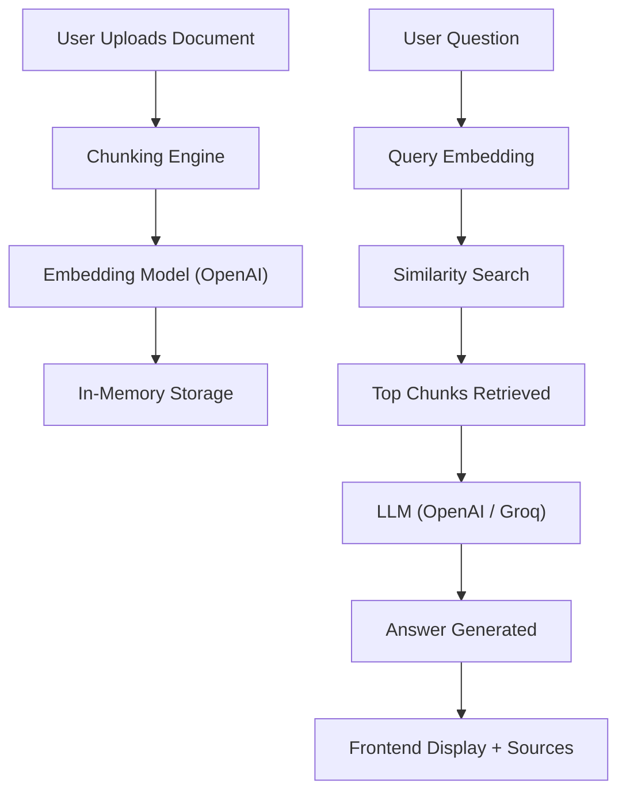

# TalentScout – Document Q&A Assistant

An AI-powered Document Question Answering system built using Retrieval-Augmented Generation (RAG).

This application allows users to upload a `.txt` document, ask questions about it, and receive answers strictly based on the document content — ensuring no hallucinations from the LLM.

---

##  Project Status

  
  
  

---

## Problem Statement

Traditional document analysis is time-consuming and inefficient, especially when dealing with large unstructured text.

This system solves the problem by:
- Allowing users to upload documents
- Automatically processing and indexing the content
- Answering questions using only the document context

---

## Tech Stack

- **Backend:** FastAPI  
- **Frontend:** HTML, CSS, JavaScript (Single Page UI)  
- **LLM:** OpenAI GPT / Groq (LLaMA)  
- **Embeddings:** OpenAI `text-embedding-3-small`  
- **Deployment:** Render (Backend), Vercel (Frontend)  

---

## Features

| Feature | Description |
|--------|------------|
|  File Upload | Upload `.txt` documents |
| Chunking | Splits document into smaller chunks |
| Semantic Search | Uses embeddings for similarity search |
|  AI Q&A | Answers questions using document context only |
|  No Hallucination | Strict prompt ensures grounded answers |
|  Source Tracking | Shows chunk indices used for answers |
|  Fast UI | Single-page HTML interface |
|  Model Flexibility | Supports OpenAI / Groq LLMs |

---

##  Architecture Overview

