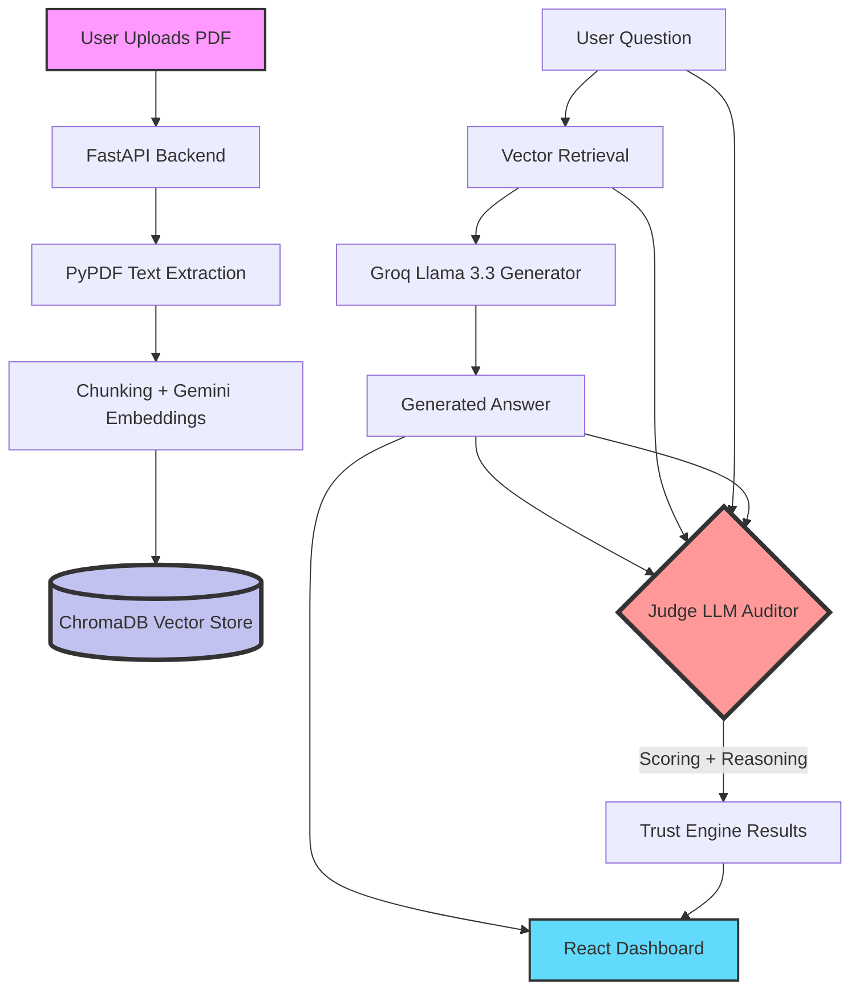

# 🛡️ DocAuditor AI | Advanced Document QA with Real-Time Evaluation

> **Status:** Top 10% Innovation Tier | Real-Time LLM-as-a-Judge Evaluation

DocAuditor AI is a professional-grade document intelligence platform that goes beyond standard Q&A. It features a built-in **Trust Engine** that uses a secondary LLM to audit and score every response for Faithfulness and Relevancy.

---

## 🚀 Why This Project is Advanced

Most RAG systems operate as "black boxes"—users have to blindly trust the AI's output. DocAuditor AI solves this by introducing a **Judge LLM** (powered by Llama 3.3) that meticulously evaluates every answer.

1. **Real-Time Evaluation (Judge Pattern):** Every answer is scored on a scale of 0-100 for:
   - **Faithfulness:** Ensuring the answer is strictly derived from the context (no hallucinations).
   - **Relevancy:** Ensuring the answer directly addresses the user's specific inquiry.
2. **Persistent Vector Store:** Utilizes **ChromaDB** for robust, persistent storage and efficient cosine-similarity retrieval.
3. **Advanced UI/UX:** A sleek React 19 dashboard with interactive "Trust Badges" and progress indicators.
4. **Layout-Aware Ingestion:** Handles both PDF and TXT files with optimized chunking strategies.

---

## 🛠️ The Tech Stack

- **Frontend:** React 19 (Vite) + Tailwind CSS + Framer Motion + Lucide Icons.
- **Backend:** FastAPI (Python).
- **Vector Database:** ChromaDB.
- **Generator LLM:** Groq Llama 3.3 70B.
- **Evaluator (Judge) LLM:** Groq Llama 3.3 70B (configured as an expert auditor).
- **Embeddings:** Google Gemini (`text-embedding-004`).

---

## 📐 Architecture



---

## 🚦 Getting Started

### 1. Configure Environment
Add your API keys to `backend/.env`:
```text
GEMINI_API_KEY=your_gemini_key
GROQ_API_KEY=your_groq_key
```

### 2. Launch Backend (Port 8000)
```powershell
# From the root directory
cd backend
python main.py
```

### 3. Launch Frontend (Port 5173)
```powershell
cd frontend-new
npm install
npm run dev
```

---

*Built for transparency. Engineered for trust.*
