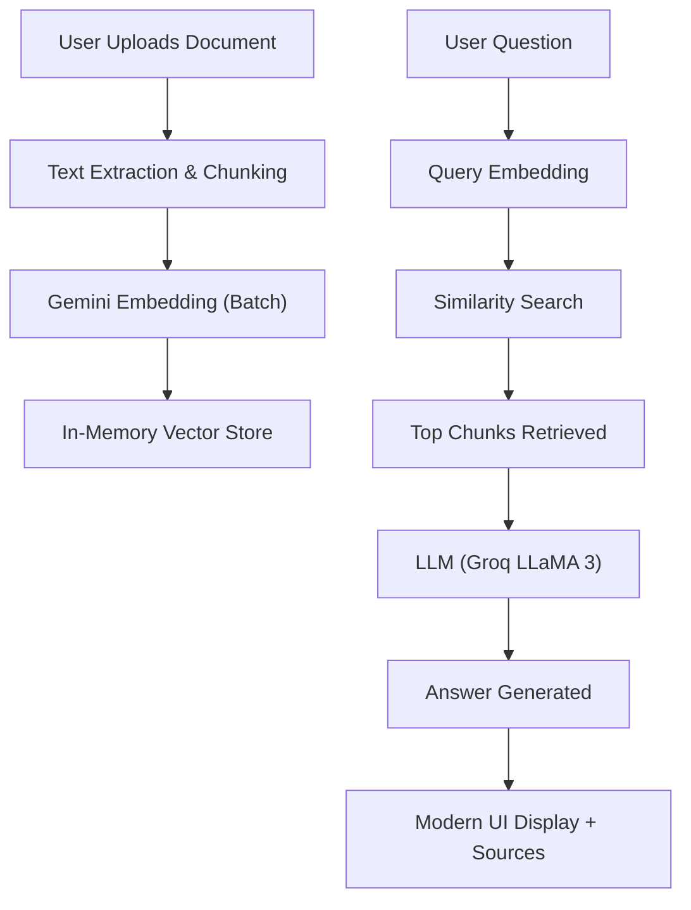
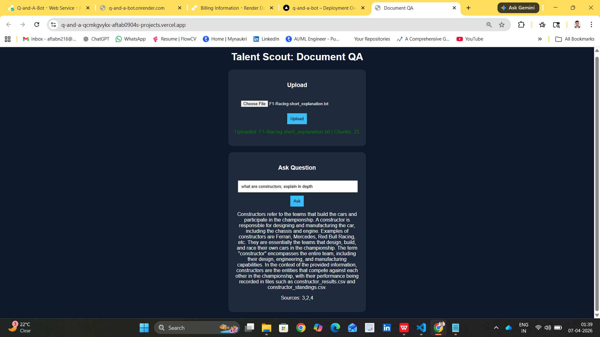
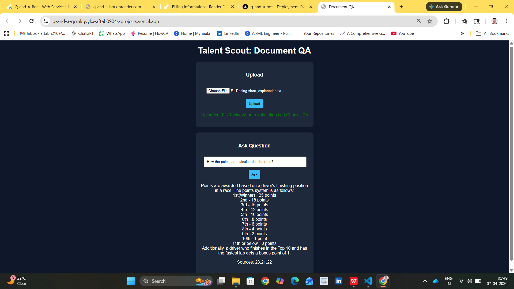
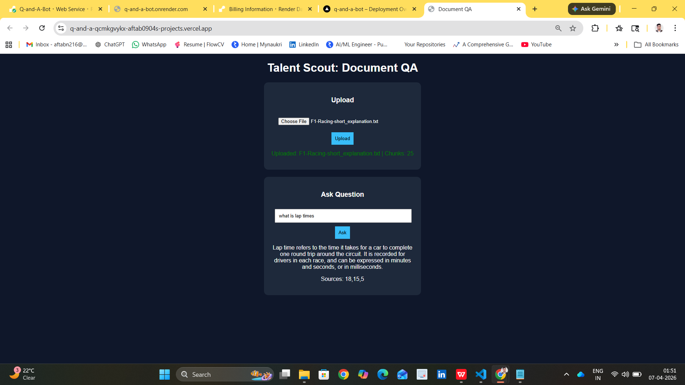
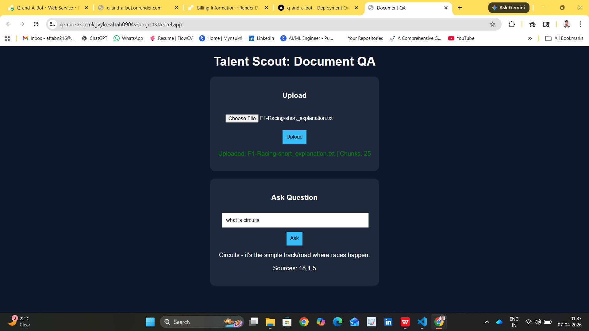
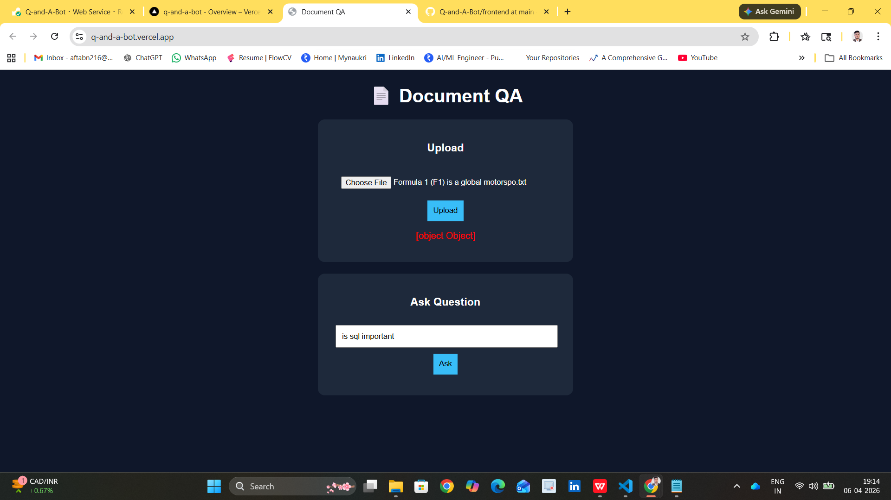
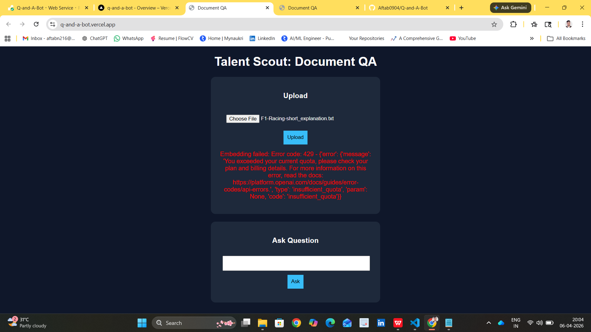

# TalentScout – Document Q&A Assistant

An Intelligent Document Question Answering system built using Retrieval-Augmented Generation (RAG), now enhanced with PDF support and a modern UI.

This application allows users to upload `.txt` or `.pdf` documents, ask questions about them, and receive answers strictly based on the document content — ensuring no hallucinations from the LLM.

---

##  Project Status

<p align="center">
  
  
  
</p>

---

## Problem Statement

Traditional document analysis is time-consuming and inefficient, especially when dealing with large unstructured text.

This system solves the problem by:
- Allowing users to upload documents (Text & PDF)
- Automatically processing and indexing the content using high-performance batch embeddings
- Answering questions using only the document context with source attribution

---

## Tech Stack

- **Backend:** FastAPI  
- **Frontend:** HTML, CSS (Modern UI), JavaScript (Single Page UI)  
- **LLM:** Groq (LLaMA 3) / OpenAI  
- **Embeddings:** GEMINI `gemini-embedding-2-preview` (Batch Optimized)  
- **Deployment:** Render (Backend), Vercel (Frontend)  

---

## Features

| Feature | Description |
|--------|------------|
| Multi-Format Upload | Now accepts both `.txt` and `.pdf` documents |
| Batch Embedding | Optimized Gemini embedding process for faster processing |
| Modern UI/UX | Sleek, dark-themed interface with loading states and animated feedback |
| Semantic Retrieval | Identifies relevant context using vector similarity |
| Context-Grounded Q&A | Ensures responses are strictly derived from document content |
| Hallucination Control | Enforced via structured prompting |
| Source Attribution | Returns chunk indices used for generating answers |

---

##  Architecture Overview



## LLM & Embedding Details

### LLM Used
- **Groq (LLaMA 3.3 70B)**: Used for fast, high-quality inference.
- **OpenAI (GPT-3.5 Turbo)**: Alternative fallback.

---

### Embedding Model
- **Google Gemini (gemini-embedding-2-preview)**: Batch optimized for performance.

---

## API Key Setup

To securely use LLM and embedding services, API keys are stored using environment variables.

### Step 1: Create a `.env` file in the backend directory

```env
GEMINI_API_KEY=your_gemini_key
GROQ_API_KEY=your_groq_key
OPENAI_API_KEY=your_openai_key
```

---

## Demo Preview

A visual walkthrough of the application:

<p align="center">
  
  
</p>

<p align="center">
  
  
</p>

<p align="center">
  
  
</p>

---

## How to Run Locally

### 1. Backend
```bash
cd document_qa/backend
pip install -r requirements.txt
uvicorn main:app --reload
```

### 2. Frontend
Open `document_qa/frontend/index.html` in any browser or use VS Code Live Server.

---

## Live Demo

- **Frontend:** [TalentScout](https://q-and-a-bot.vercel.app/)
- **Backend API:** [Hosted on Render](https://q-and-a-bot.onrender.com)
