# DocAuditor AI | Advanced Document QA with Real-Time Evaluation

> **Status:** Top 10% Innovation Tier | Real-Time LLM-as-a-Judge Evaluation

DocAuditor AI is a professional-grade document intelligence platform that goes beyond standard Q&A. It features a built-in **Trust Engine** that uses a secondary LLM to audit and score every response for Faithfulness and Relevancy.

---

## Tech Stack


---

## Demo

| Watch the Video | Explore the App |
| :---: | :---: |
| [](https://youtu.be/USRkALlGbaE) | [**Live Demo Link**](https://youtu.be/USRkALlGbaE) |

### Screenshots

<p align="center">
  
  
</p>
<p align="center">
  
  
</p>
<p align="center">
  
</p>

---

## Why This Project is Advanced

Most RAG systems operate as "black boxes"—users have to blindly trust the AI's output. DocAuditor AI solves this by introducing a **Judge LLM** (powered by Llama 3.3) that meticulously evaluates every answer.

1. **Real-Time Evaluation (Judge Pattern):** Every answer is scored on a scale of 0-100 for:
   - **Faithfulness:** Ensuring the answer is strictly derived from the context (no hallucinations).
   - **Relevancy:** Ensuring the answer directly addresses the user's specific inquiry.
2. **Persistent Vector Store:** Utilizes **ChromaDB** for robust, persistent storage and efficient cosine-similarity retrieval.
3. **Advanced UI/UX:** A sleek React 19 dashboard with interactive "Trust Badges" and progress indicators.
4. **Layout-Aware Ingestion:** Handles both PDF and TXT files with optimized chunking strategies.

---

## Architecture

```mermaid
graph TD
    A[User Uploads PDF/TXT] --> B[FastAPI Ingestion Engine]
    B --> C[PyPDF Text Extraction]
    C --> D[Chunking + Gemini Embeddings]
    D --> E[(ChromaDB Vector Store)]
    
    F[User Technical Question] --> G[Semantic Vector Retrieval]
    G --> H[Groq Llama 3.3 Generator]
    H --> I[AI Generated Answer]
    
    I --> J{Judge LLM Auditor}
    G & F & I --> J
    J -- Quality Scoring --> K[Trust Engine Results]
    
    K & I --> L[React 19 Dashboard]
    
    classDef box color:#fff,stroke:#fff,stroke-width:2px;
    class A,B,C,D,E,F,G,H,I,J,K,L box;

    style A fill:#B03A2E
    style B fill:#1F618D
    style C fill:#1E8449
    style D fill:#D68910
    style E fill:#7D3C98,stroke-width:4px
    style F fill:#AF7AC5
    style G fill:#2471A3
    style H fill:#117864
    style I fill:#283747
    style J fill:#641E16,stroke-width:4px
    style K fill:#154360
    style L fill:#1B4F72
```



---

## Getting Started

### 1. Configure Environment
Add your API keys to `backend/.env`:
```text
GEMINI_API_KEY=your_gemini_key
GROQ_API_KEY=your_groq_key
```

### 2. Launch Backend (Port 8000)
```powershell
# From the root directory
cd backend
python main.py
```

### 3. Launch Frontend (Port 5173)
```powershell
cd frontend-new
npm install
npm run dev
```

---

*Built for transparency. Engineered for trust.*
