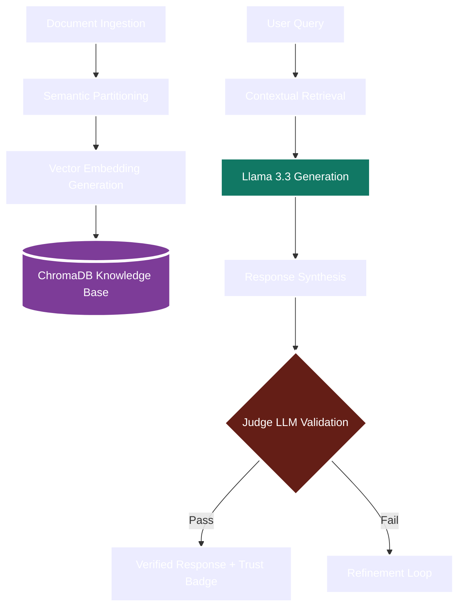

# DocAuditor AI | Advanced Document QA with Real-Time Evaluation

> **Status:** Top 10% Innovation Tier | Real-Time LLM-as-a-Judge Evaluation

DocAuditor AI is a professional-grade document intelligence platform that goes beyond standard Q&A. It features a built-in **Trust Engine** that uses a secondary LLM to audit and score every response for Faithfulness and Relevancy.

---

## Tech Stack


---

## Demo

| Watch the Video | Explore the App |
| :---: | :---: |
| [](https://youtu.be/USRkALlGbaE) | [**Live Demo Link**](https://youtu.be/USRkALlGbaE) |

### Screenshots

<p align="center">
  
  
</p>
<p align="center">
  
  
</p>
<p align="center">
  
</p>

---

## Core Innovation: LLM-as-a-Judge

Most RAG systems operate as "black boxes"—users have to blindly trust the AI's output. DocAuditor AI solves this by introducing a **Judge LLM** (powered by Llama 3.3) that meticulously evaluates every answer generated by the primary agent.

1. **Faithfulness Audit:** The Judge LLM compares the generated response against the retrieved source chunks to ensure zero hallucination.
2. **Relevancy Scoring:** The response is validated against the user's intent to ensure the answer is direct and actionable.
3. **Trust Metadata:** Every interaction returns a confidence score, providing full transparency into the AI's reasoning process.

---

## Architecture & System Flow

The system follows a decoupled microservices architecture designed for low-latency retrieval and high-fidelity generation.



### System Execution Flow
- **Ingestion:** Documents are processed via a layout-aware extraction engine that preserves structural integrity.
- **Retrieval:** Utilizes cosine similarity across high-dimensional vector space for pinpoint accuracy.
- **Evaluation:** The "Trust Engine" executes a multi-shot prompt strategy to audit the generator's output before it reaches the UI.

---

## Deployment & Setup

### 1. Environment Configuration
Ensure your API keys are configured in `backend/.env`:
```text
GEMINI_API_KEY=your_gemini_key
GROQ_API_KEY=your_groq_key
```

### 2. Backend Initialization
```powershell
cd backend
python main.py
```

### 3. Frontend Dashboard
```powershell
cd frontend-new
npm install
npm run dev
```

---

## Conclusion

DocAuditor AI represents a shift towards **Explainable AI (XAI)** in document intelligence. By integrating real-time auditing and high-performance vector retrieval, it provides a reliable framework for enterprise-grade document Q&A where accuracy is non-negotiable.

*Built for transparency. Engineered for trust.*
