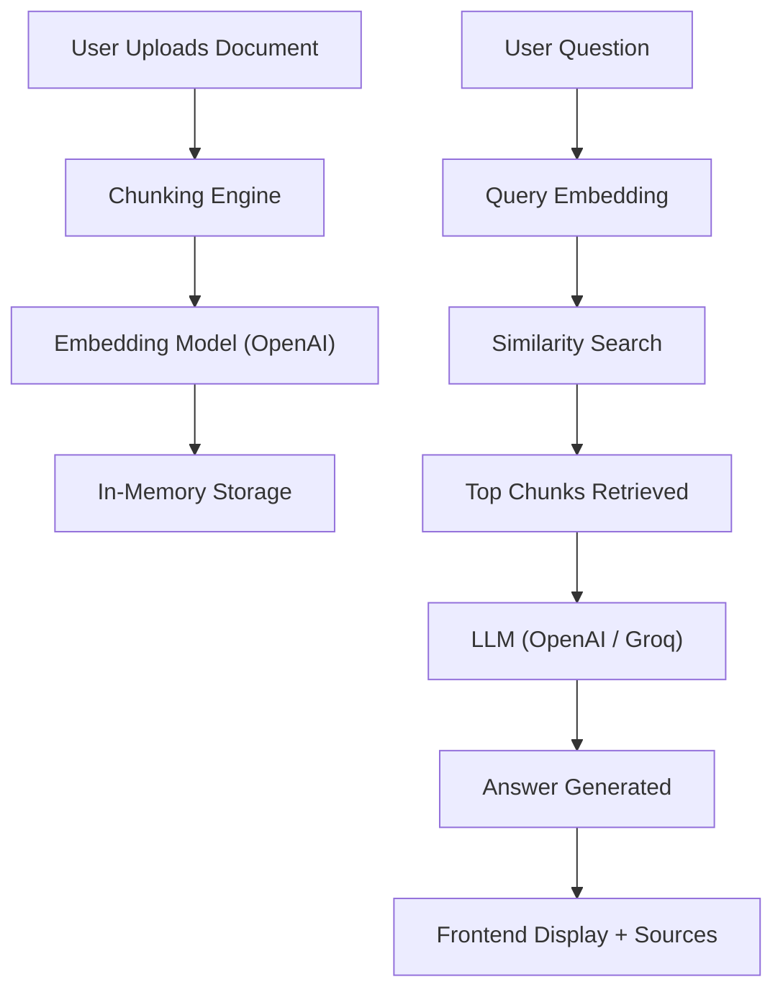

# TalentScout – Document Q&A Assistant

An Intelligent Document Question Answering system built using Retrieval-Augmented Generation (RAG).

This application allows users to upload a `.txt` document, ask questions about it, and receive answers strictly based on the document content — ensuring no hallucinations from the LLM.

---

##  Project Status

<p align="center">
  
  
  
</p>

---

## Problem Statement

Traditional document analysis is time-consuming and inefficient, especially when dealing with large unstructured text.

This system solves the problem by:
- Allowing users to upload documents
- Automatically processing and indexing the content
- Answering questions using only the document context

---

## Tech Stack

- **Backend:** FastAPI  
- **Frontend:** HTML, CSS, JavaScript (Single Page UI)  
- **LLM:** OpenAI GPT / Groq (LLaMA)  
- **Embeddings:** GEMINI `gemini-embedding-2-preview`  
- **Deployment:** Render (Backend), Vercel (Frontend)  

---

## Features

| Feature | Description |
|--------|------------|
| File Upload | Accepts `.txt` documents for processing |
| Chunking Strategy | Splits text into overlapping segments for better retrieval |
| Semantic Retrieval | Identifies relevant context using vector similarity |
| Context-Grounded Q&A | Ensures responses are strictly derived from document content |
| Hallucination Control | Enforced via structured prompting |
| Source Attribution | Returns chunk indices used for generating answers |
| Error Handling | Implements proper HTTP status codes for all edge cases |
| Modular Design | Easily extendable for multiple models and storage layers |

---

##  Architecture Overview



## LLM & Embedding Details

### LLM Used
- **OpenAI (GPT-3.5 Turbo)**
- **Groq (LLaMA 3)**

**Why these models?**
- Fast response time suitable for real-time applications  
- High-quality and reliable answers  
- Easy API integration  
- Groq provides a free and fast inference option  

---

### Embedding Model
- **GoogleGemini**

**Why this embedding model?**
- Lightweight and efficient (important for deployment on free-tier services)  
- Good semantic understanding for document retrieval  
- Avoids heavy local models like sentence-transformers, reducing memory usage  

---

## API Key Setup

To securely use LLM and embedding services, API keys are stored using environment variables.

### Step 1: Create a `.env` file in the backend directory

---

### Step 2: Load environment variables in code

```python
from dotenv import load_dotenv
import os

load_dotenv()

OPENAI_API_KEY = os.getenv("OPENAI_API_KEY")
GROQ_API_KEY = os.getenv("GROQ_API_KEY")

```
---

## Live Demo

- **Frontend:** [TalentScout](https://q-and-a-bot.vercel.app/?_vercel_share=xVkGohIJrsCumGgSS0OvUuzPpAXmALpj)
- **Backend API:** [API Documentation](https://render.com/docs)

---

## Demo Preview

A visual walkthrough of the application is included below:

<p align="center">
  
  
</p>

<p align="center">
  
  
</p>

<p align="center">
  
  
</p>

